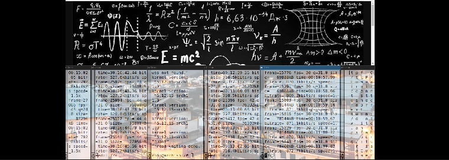

<DOCTYPE html>
<html>
 <section id="about">
      
      

        <h1>More about my projects</h1>
        
This is me, Spineci Cosmin and this is my life and project

      

  Status 
  -- working on a game rendering engine
    </section>
 <head> 
Checkout below
 </head>
 <body>
 <!-- 

    Tutorial - installing a debian image <a href="https://drspineci.github.io/install-debian.text" > debian image </a>
  

  -->
   

    Tutorial -  <a href="https://drspineci.github.io/encrypt2-0.sh" > encrypting </a> with openssl and  <a href="https://drspineci.github.io/decrypt2-0.sh" > decrypting </a> a folder or file 
  

  
  

  Utility cypher : <a href="https://github.com/drspineci/drspineci.github.io/blob/main/t-encrypting-and-decrypting-files.md" > T- encrypt & decrypt big data  </a>
  

  
  
 

Check out more about me <a href="https://drspineci.github.io/cv.spineci-PDL.txt" > here</a>
  

  
  
  
 </body>  
  </html>
