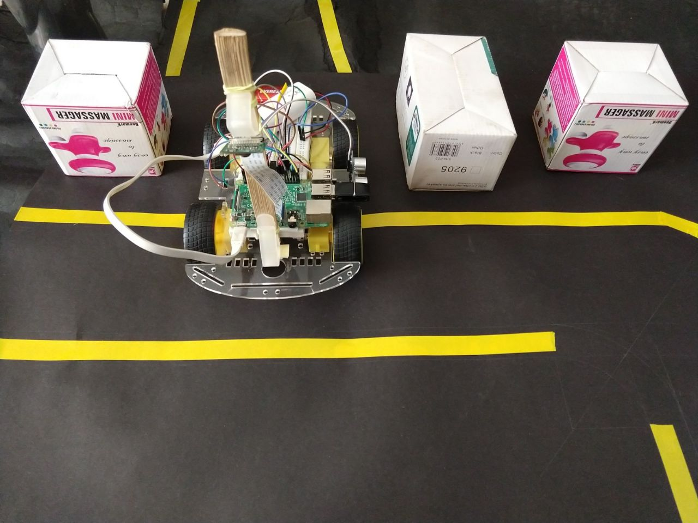
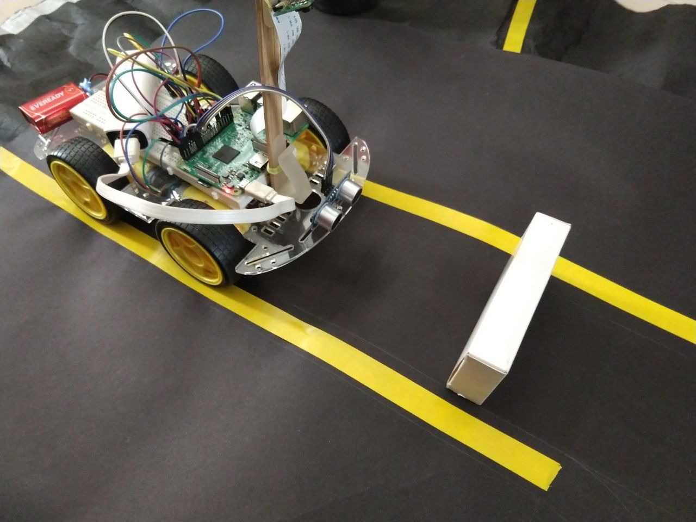

<html>
 
     
 <head>
     <h1>More about my projects</h1>
        
This is me, Spineci Cosmin and this is my life and project

I was born in Buzau, Romania, eastern Europe. 

I have failed at many things.

I tried to become a football player. I always ended in defense. 

I tried to become a professional diplomat, before politician. I started to swear and made phoney gags over the internet and i am very disapointed. 

I tried to become a researcher, i ended up with a politician, but i did not have enough time to purpouse that mathematics, so i started. 

I discovered i loved computer science and computers. Programming, data and intelligence. I love running, doing research for id without a scheduele so if you need help please give me a call.

  Cosmyi: Programmer, STEM & Free Software Lawyer, Enlightened Agent, Transhumanist, Debian contributor 

Checkout below
  -------------------------------------
 </head>
 <body>
  

   Hardware recovery and manufacturing
  Utility cypher : <a href="https://github.com/drspineci/drspineci.github.io/blob/main/t-encrypting-and-decrypting-files.md" > T- encrypt & decrypt big data  </a>
  

  

   When you are a parent and you don't know what you son does as a computer programmer 
  The law of copyright in computer programming : <a href="https://github.com/drspineci/drspineci.github.io/blob/main/c.pdf" >Important to protect arount piracy and vigilantee acts</a>
  

	Started reading a Great book about "Jenkins" by John Ferguson Smart 

Check out more about me <a href="https://drspineci.github.io/cv.spineci-PDL.txt" > here</a>
  

 
	Helping to test out the new content type. 
  
  

 
</body>  
  
  <section id="about">
       Status 
  -- working on a game rendering engine
    </section>
  </html>
